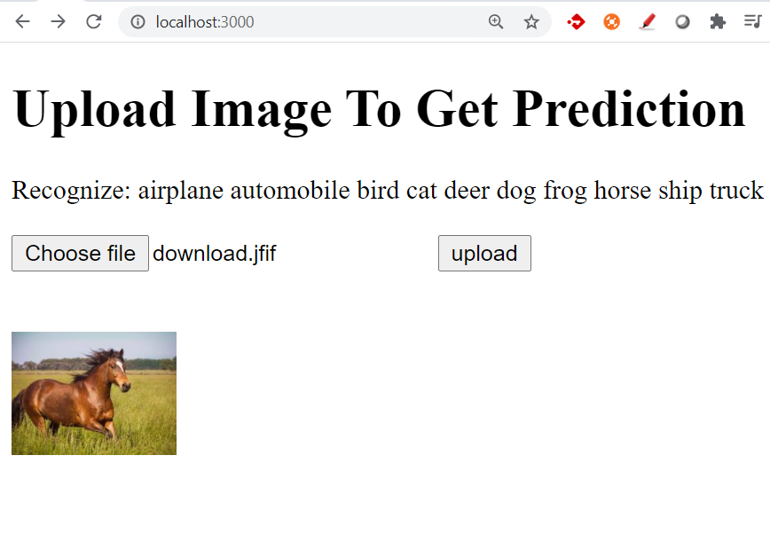
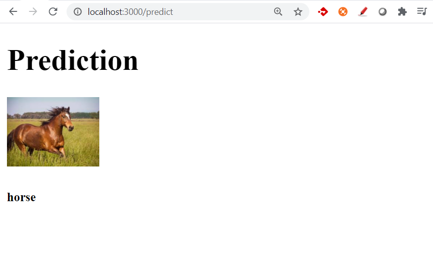

# Image-classification-using-nodejs

This is an example of how to use the ML pre built model in node JS

### Steps To Run:

- Clone the repo
- npm i
- Open http://loachost:3000/
- Enjoy!

### Screenshots

